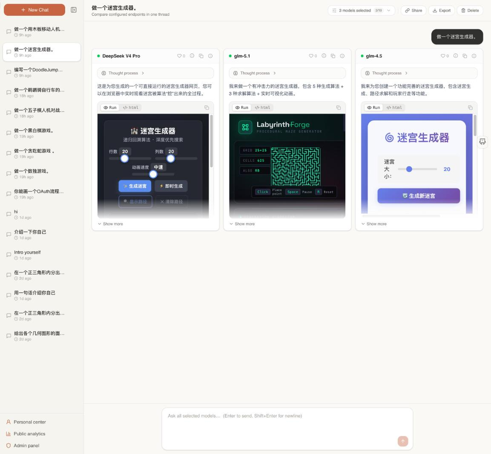

# 🐙 Octopus LLM

**Ask once, compare every model.** Octopus LLM is a self-hostable platform that sends a single
prompt to many LLM endpoints **concurrently** and streams their answers **side by side**, so you can
judge quality, latency, and cost across providers in one place.



> The shot above is one prompt — *"make a maze generator"* — answered in parallel by three models,
> with each model's generated HTML toggled to **Run** so the live result renders right in the
> response.

---

## Why

Picking an LLM by reading benchmarks is guesswork. Octopus LLM lets you put your **own** prompts,
your **own** API keys, and your **own** models head-to-head, then keeps an immutable history so you
can revisit and share the comparison later.

## Features

- **Parallel multi-model comparison** — one prompt fans out to every selected model at once; partial
  results stream in real time (SSE), never blocked by the slowest provider.
- **Provider-agnostic adapters** — Anthropic, OpenAI-compatible, and MiniMax today, each behind a
  uniform adapter; new providers are a single adapter + config entry.
- **Bring your own keys (BYOK)** — per-user encrypted connections and configured models, with
  per-model capability metadata.
- **Rich response rendering** — bounded, copyable code blocks; source⇄preview toggle for Mermaid,
  PlantUML (self-hosted), and SVG; self-contained HTML/JS **runs in a sandboxed iframe** on demand.
- **Immutable history & sharing** — saved sessions are append-only; share any conversation via an
  opaque, revocable link with full rendering parity on the public view.
- **Personal center & analytics** — profile, per-response likes, and user-scoped usage analytics
  over an immutable response log; plus anonymous aggregate analytics.
- **Admin control panel** — user, connection, and model administration with an audit log.
- **Multimedia support** *(in progress)* — image/video/audio attachments with per-model capability
  gating, configurable local or S3/OSS storage, and in-chat voice input. See
  [`specs/007-multimedia-support`](specs/007-multimedia-support/).

## Tech Stack

| Layer | Technology |
|-------|-----------|
| Backend | Kotlin (Java 21), Spring Boot **WebFlux** (reactive/streaming), Spring Security |
| Persistence | PostgreSQL, Flyway migrations, Spring Data JPA/Hibernate |
| Frontend | Next.js (App Router), React 19, TypeScript (strict), Tailwind CSS |
| Rendering | react-markdown, Mermaid, PlantUML (self-hosted), DOMPurify, KaTeX |
| Infra | Docker Compose (Postgres, backend, frontend, PlantUML, MailHog) |

## Quick Start

Requirements: Docker + Docker Compose.

```bash
git clone git@github.com:hugogu/octopus-llm.git
cd octopus-llm
cp .env.example .env     # fill in required values
docker compose up --build
```

- Frontend: <http://localhost:3001>
- Backend API: <http://localhost:8080> (versioned under `/api/v1` and `/api/v2`)

Register the first account, add a connection (your provider base URL + API key), configure one or
more models, then open **Chat**, select the models to compare, and send a prompt.

### Local development

```bash
# Backend
cd backend && ./gradlew build          # compile + tests
# Frontend
cd frontend && npm install && npm run dev
cd frontend && npx tsc --noEmit        # type-check gate
```

## Project Structure

```text
backend/    Kotlin / Spring WebFlux service (adapters, chat, share, analytics, admin, render)
frontend/   Next.js App Router app ((app)/chat, (app)/admin, (app)/account, public share & analytics)
specs/      Feature specifications, plans, and tasks (spec-driven development)
docker-compose.yml
```

The project is built **spec-first**: each feature lives under `specs/NNN-*/` with a spec, plan,
data model, contracts, and task list before implementation.

## License

Licensed under the **Apache License 2.0** — see [LICENSE](LICENSE).

Apache 2.0 is a permissive license: you may use, modify, and distribute Octopus LLM — including in
commercial and proprietary products — provided you preserve the copyright and license notices and
state significant changes. It also includes an express patent grant from contributors.

© 2026 Hugo Gu. Licensed under the Apache License, Version 2.0.
